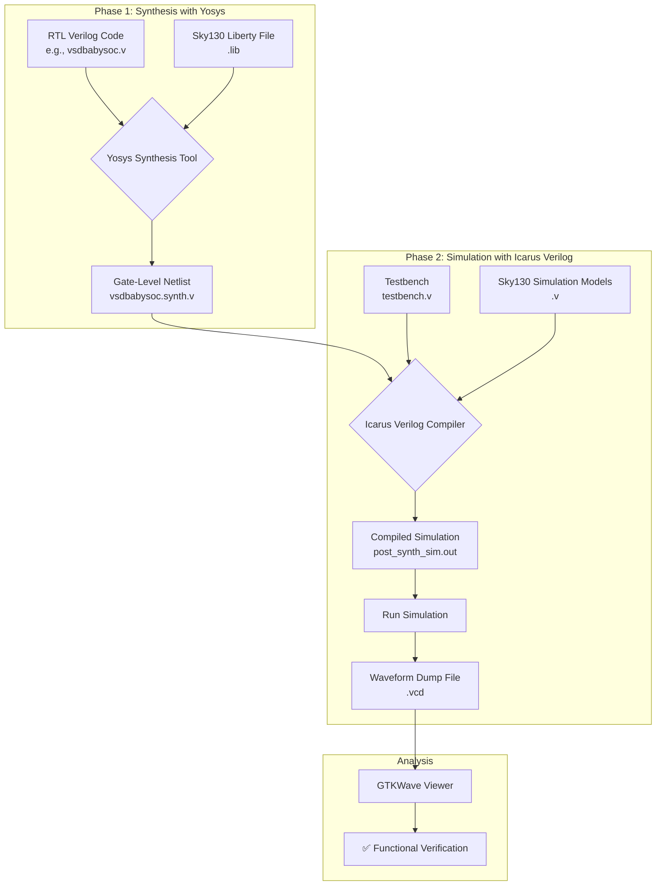

# Week 3 Task: Post-Synthesis GLS & STA Fundamentals

This document details the step-by-step process of synthesizing the BabySoC RTL design into a gate-level netlist and performing a post-synthesis Gate-Level Simulation (GLS) to verify its functional correctness.

## 📋 Table of Contents

1.  [Objective](https://www.google.com/search?q=%23-objective)
2.  [Prerequisites](https://www.google.com/search?q=%23-prerequisites)
3.  [Workflow Overview](https://www.google.com/search?q=%23-workflow-overview)
4.  [Phase 1: Synthesis (RTL to Netlist)](https://www.google.com/search?q=%23-phase-1-synthesis-rtl-to-netlist)
5.  [Phase 2: Post-Synthesis Simulation (GLS)](https://www.google.com/search?q=%23-phase-2-post-synthesis-simulation-gls)
6.  [Verification and Deliverables](https://www.google.com/search?q=%23-verification-and-deliverables)

-----

## 🎯 Objective

The goal is to convert the high-level Register-Transfer Level (RTL) code of the BabySoC into a lower-level, gate-based representation (a **netlist**) using the **Sky130 PDK**. Afterward, we'll run a Gate-Level Simulation (GLS) on this netlist to confirm that its logical behavior is identical to the original RTL design. This is a critical step to ensure the synthesis tool has not introduced any functional errors.

-----

## 🛠️ Prerequisites

Before you begin, ensure the following tools are installed and configured in your active `(sp_env)` environment:

  * **Yosys:** An open-source framework for Verilog RTL synthesis.
  * **Icarus Verilog (`iverilog`):** A Verilog compiler and simulator.
  * **GTKWave:** A waveform viewer for analyzing simulation results.
  * **Sky130 PDK:** The Process Design Kit files for the chosen technology node.

-----

## 🌊 Workflow Overview

The entire process, from RTL code to functional verification, can be visualized in two main stages: Synthesis and Simulation.



-----

## 🔬 Phase 1: Synthesis (RTL to Netlist)

In this phase, we use the **Yosys** tool to translate our abstract RTL code into a concrete netlist composed of standard logic gates (like AND, OR, D-Flip-Flops) from the Sky130 library. The entire terminal output from this process serves as the **synthesis log**.

### Step 1.1: Launch Yosys and Load Design Files

First, we start the Yosys synthesis tool and load our Verilog source files.

  * **Purpose:** These `read_verilog` commands load the hardware description of our design into Yosys's memory. The `-I` flag specifies an "include" directory, which is necessary for modules that reference other files (like header files with `define` statements).

<!-- end list -->

```bash
# Navigate to your project root
cd ~/VLSI/VSDBabySoC

# Launch the Yosys synthesis suite
yosys
```

```tcl
# Inside Yosys, run these commands:
# Load the top-level SoC module
read_verilog /home/purushotham/VLSI/VSDBabySoC/src/module/vsdbabysoc.v

# Load the RISC-V core, specifying the include path
read_verilog -I /home/purushotham/VLSI/VSDBabySoC/src/include /home/purushotham/VLSI/VSDBabySoC/src/module/rvmyth.v

# Load the clock gating module
read_verilog -I /home/purushotham/VLSI/VSDBabySoC/src/include /home/purushotham/VLSI/VSDBabySoC/src/module/clk_gate.v
```

> **📸 Snapshot:**
>
> \

### Step 1.2: Load Technology Libraries

Next, we load the `.lib` files, which describe the characteristics of the standard cells available in our technology (Sky130).

  * **Purpose:** The `read_liberty` command provides Yosys with the "building blocks" it can use for synthesis. These files contain critical information about each logic gate, such as its function, timing characteristics, and power consumption.

<!-- end list -->

```tcl
# Load the liberty files for custom macros (PLL, DAC)
read_liberty -lib /home/purushotham/VLSI/VSDBabySoC/src/lib/avsdpll.lib
read_liberty -lib /home/purushotham/VLSI/VSDBabySoC/src/lib/avsddac.lib

# Load the main Sky130 high-density standard cell library
read_liberty -lib /home/purushotham/VLSI/VSDBabySoC/src/lib/sky130_fd_sc_hd__tt_025C_1v80.lib
```

> **📸 Snapshot:**
>
> \

### Step 1.3: Synthesize and Map the Design

This sequence of commands performs the core synthesis, mapping, and optimization flow.

**1. Run High-Level Synthesis**

  * **Purpose:** `synth -top vsdbabysoc` is a high-level command that runs a default synthesis script. It translates the behavioral Verilog code (e.g., `always @*` blocks) into a generic, technology-independent gate representation.

<!-- end list -->

```tcl
synth -top vsdbabysoc
```

> **📸 Snapshot:**
>
> \

**2. Map Flip-Flops**

  * **Purpose:** The `dfflibmap` command specifically maps the generic D-Flip-Flops inferred by the synthesis tool to actual flip-flop cells defined in the Sky130 liberty file.

<!-- end list -->

```tcl
dfflibmap -liberty /home/purushotham/VLSI/VSDBabySoC/src/lib/sky130_fd_sc_hd__tt_025C_1v80.lib
```

> **📸 Snapshot:**
>
> \

**3. Perform Standard Optimizations & Technology Mapping with ABC**

  * **Purpose:** The `opt` command performs general logic optimizations, like removing redundant gates. Then, `abc` is used for **technology mapping**. It takes the generic gate representation and maps it to the specific standard cells available in the Sky130 library, while trying to optimize for area and delay based on the provided script.

<!-- end list -->

```tcl
opt
abc -liberty /home/purushotham/VLSI/VSDBabySoC/src/lib/sky130_fd_sc_hd__tt_025C_1v80.lib -script +strash;scorr;ifraig;retime;{D};strash;dch,-f;map,-M,1,{D}
```

> **📸 Snapshot:**
>
> \

**4. Clean Up the Design Hierarchy**

  * **Purpose:** This series of commands performs housekeeping on the final netlist to make it clean and robust for the next stages of the design flow.
      * `flatten`: Collapses the design hierarchy into a single module.
      * `setundef -zero`: Ties any undriven (floating) wires to a logic '0' to prevent unknown states ('X') in simulation.
      * `clean -purge`: Removes any cells or wires that are left unused after optimization.
      * `rename -enumerate`: Assigns simple, unique names to internal components for easier debugging.

<!-- end list -->

```tcl
flatten
setundef -zero
clean -purge
rename -enumerate
```

> **📸 Snapshot:**
>
> \

### Step 1.4: Check Statistics and Write the Netlist

Finally, we review a summary of the synthesized design and write the result to a new Verilog file.

  * **Purpose:** `stat` prints a report showing the number and types of cells used in the final design, which is useful for a quick check. `write_verilog` generates the final **gate-level netlist file**, which is the primary output of this entire phase.

<!-- end list -->

```tcl
# Check statistics of the synthesized design
stat

# Write the synthesized netlist to a Verilog file
write_verilog -noattr /home/purushotham/VLSI/VSDBabySoC/output/post_synth_sim/vsdbabysoc.synth.v
```

> **📸 Snapshot:**
>
> \
> \

After this, type `exit` to leave Yosys.

-----

## ⚡ Phase 2: Post-Synthesis Simulation (GLS)

Now we will compile and simulate the generated netlist using **Icarus Verilog** to verify its functionality and generate a waveform.

### Step 2.1: Compile the Testbench and Netlist

  * **Purpose:** This `iverilog` command compiles all the necessary files into a single simulation executable.
      * `-o`: Specifies the name of the output executable (`post_synth_sim.out`).
      * `-DPOST_SYNTH_SIM`: This is a crucial preprocessor macro. It tells our testbench to instantiate the **synthesized netlist** instead of the original RTL code.
      * `-I`: Specifies the directories where the compiler should look for included files (our modules, the netlist, and the Sky130 simulation models).
      * The final file paths point to the **simulation models** for the Sky130 cells (`primitives.v`, `sky130_fd_sc_hd.v`) and our testbench (`testbench.v`).

<!-- end list -->

```bash
iverilog -o ~/VLSI/VSDBabySoC/output/post_synth_sim/post_synth_sim.out \
-DPOST_SYNTH_SIM -DFUNCTIONAL -DUNIT_DELAY=#1 \
-I ~/VLSI/VSDBabySoC/src/include \
-I ~/VLSI/VSDBabySoC/src/module \
-I ~/VLSI/VSDBabySoC/src/gls_model \
-I ~/VLSI/VSDBabySoC/output/post_synth_sim \
~/VLSI/VSDBabySoC/src/gls_model/primitives.v \
~/VLSI/VSDBabySoC/src/gls_model/sky130_fd_sc_hd.v \
~/VLSI/VSDBabySoC/src/module/testbench.v
```

> **📸 Snapshot:**
>
> \

### Step 2.2: Run the Simulation

  * **Purpose:** We execute the compiled file. This runs the simulation defined in our testbench, which will now drive inputs and monitor outputs on the synthesized gate-level netlist. During execution, it will generate a `post_synth_sim.vcd` file containing the waveform data.

<!-- end list -->

```bash
# Navigate to the output directory
cd ~/VLSI/VSDBabySoC/output/post_synth_sim/

# Run the simulation executable
./post_synth_sim.out
```

### Step 2.3: Analyze the Waveforms

  * **Purpose:** We use `gtkwave` to open the `.vcd` file and visualize the signal activity over time. This allows us to visually inspect the outputs and confirm correct behavior.

<!-- end list -->

```bash
gtkwave post_synth_sim.vcd
```

> **📸 Final Output Waveform (Deliverable):**
> This screenshot shows the final waveform from the Gate-Level Simulation. We can observe the `la_output` changing as the processor executes instructions, demonstrating that the synthesized design is functionally active.
> \

-----

## ✅ Verification and Deliverables

This section summarizes the key deliverables for this task.

### Synthesis Logs

The complete console output from the Yosys synthesis process, as documented with snapshots in **Phase 1**, serves as the synthesis log deliverable.

### GLS Waveform Screenshot

The GTKWave screenshot captured in **Step 2.3** provides the final GLS waveform, which is the primary deliverable for the simulation phase.

### Confirmation: GLS vs. Functional Simulation

The Gate-Level Simulation (GLS) for the BabySoC design was successfully completed. The behavior of the key output signals (`la_output`, etc.) observed in the GLS waveform was compared against the functional RTL simulation waveforms from Week 2.

**Conclusion:** The results are **functionally identical**. This confirms that the synthesis process correctly translated the RTL design into a gate-level netlist without altering its logical behavior, validating the integrity of our synthesis flow. ✅
