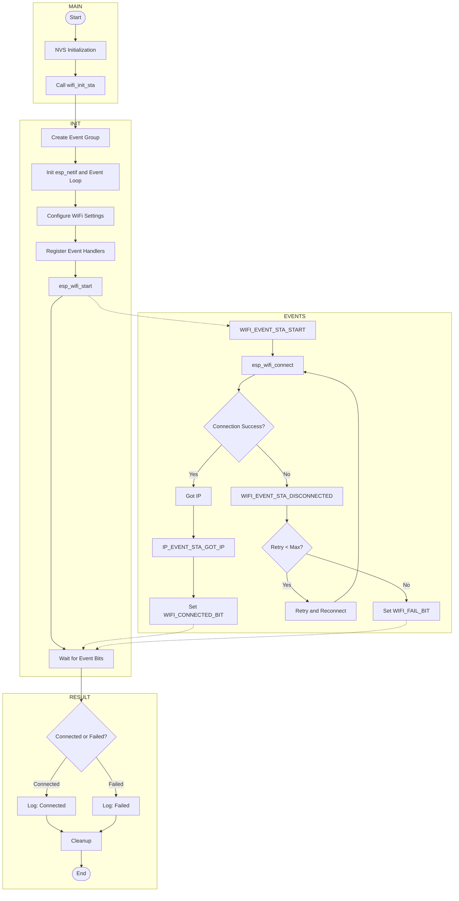

# WiFi Station Execution Flow


```mermaid
flowchart TD

    %% MAIN TASK
    subgraph MAIN
        A1([Start]) --> A2[NVS Initialization]
        A2 --> A3[Call wifi_init_sta]
    end

    %% WIFI INIT
    subgraph INIT
        A3 --> B1[Create Event Group]
        B1 --> B2[Init esp_netif and Event Loop]
        B2 --> B3[Configure WiFi Settings]
        B3 --> B4[Register Event Handlers]
        B4 --> B5[esp_wifi_start]
        B5 --> B6[Wait for Event Bits]
    end

    %% EVENT HANDLER
    subgraph EVENTS
        B5 -.-> C1[WIFI_EVENT_STA_START]
        C1 --> C2[esp_wifi_connect]

        C2 --> C3{Connection Success?}

        C3 -- Yes --> C4[Got IP]
        C4 --> C5[IP_EVENT_STA_GOT_IP]
        C5 --> C6[Set WIFI_CONNECTED_BIT]

        C3 -- No --> C7[WIFI_EVENT_STA_DISCONNECTED]
        C7 --> C8{Retry < Max?}

        C8 -- Yes --> C9[Retry and Reconnect]
        C9 --> C2

        C8 -- No --> C10[Set WIFI_FAIL_BIT]
    end

    %% RESULT HANDLING
    subgraph RESULT
        C6 -.-> B6
        C10 -.-> B6

        B6 --> R1{Connected or Failed?}

        R1 -- Connected --> R2[Log: Connected]
        R1 -- Failed --> R3[Log: Failed]

        R2 --> R4[Cleanup]
        R3 --> R4
        R4 --> R5([End])
    end
```

```
